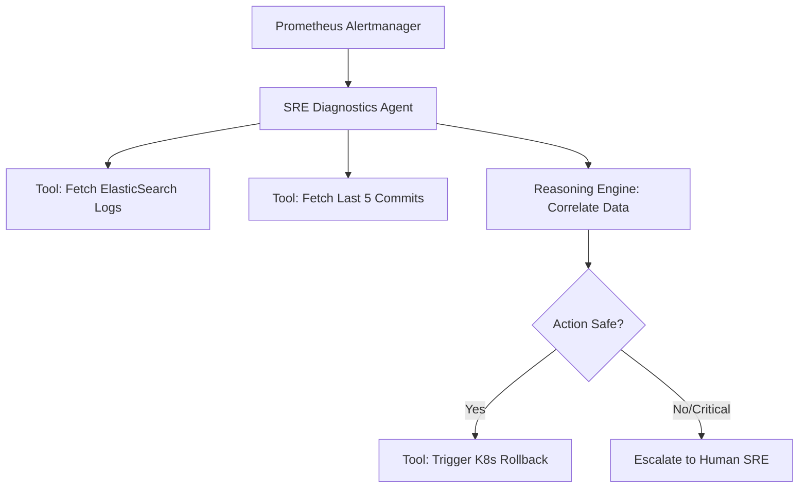

The technology landscape is transitioning from "Copilots"—systems that act as interactive autocompletes requiring synchronous prompting—to **Autonomous Agents**. Unlike stateless LLM endpoints, AI agents are stateful, closed-loop systems capable of dynamic reasoning, self-correction, execution of tools, and planning across multi-step horizons. 

For software engineers, understanding the architectures, design patterns, and constraints of these systems is critical. This guide explores the top ten most impactful and practical use cases for AI agents across five key enterprise domains, focusing on the engineering realities behind how and why they work.

---

## 1. Customer Operations and Support

### Use Case 1: Autonomous Customer Service Engineers
Traditional chatbots rely on hardcoded decision trees. When a customer's query deviates from the happy path, these systems fail. By contrast, an Autonomous Customer Service Agent behaves as a dynamic workflow coordinator. It operates over a set of secure, declarative tool sandboxes to query state, resolve edge cases, and perform write-actions safely.

#### The Why
Customer actions (like processing custom refunds or modifications to account tiers) are inherently conditional. A hardcoded solution requires anticipating every permutation of enterprise policies. An agentic approach uses the LLM as a "routing and reasoning engine" that takes raw inputs, evaluates complex refund algorithms, and invokes lower-level REST APIs to execute the required adjustments.

#### The How
An agent combines database lookup tools with write-conforming endpoints, wrapping critical mutations inside validation guardrails.

```python
from typing import Dict, Any
from pydantic import BaseModel, Field

class RefundEvaluation(BaseModel):
    is_eligible: bool = Field(description="True if customer order is within the 30-day refund window.")
    max_allowable_refund: int = Field(description="Maximum refund amount in cents.")
    reasoning: str = Field(description="Step-by-step policy verification justification.")

def verify_and_refund_tool(order_id: str, refund_cents: int) -> Dict[str, Any]:
    """
    Agent-facing tool to securely process refunds. Outsources condition checking 
    to the LLM prompt while strictly validating inputs and constraints programmatically.
    """
    order = db.fetch_order(order_id) # Fetch database record
    
    # Declarative schema verification before calling Stripe API
    if refund_cents > order.amount_cents:
        return {"status": "error", "message": "Refund amount exceeds order value."}
    
    # If valid, invoke external Stripe payment processor
    stripe_response = stripe.Refund.create(
        payment_intent=order.payment_intent_id,
        amount=refund_cents
    )
    db.update_order_status(order_id, status="refunded", refunded_amount=refund_cents)
    return {"status": "success", "charge_id": stripe_response.id}
```

---

### Use Case 2: Dynamic Onboarding and Troubleshooting Guides
Static onboarding guides fail when they encounter diverse developer environments, custom network setups, or dynamic configuration variables. A dynamic agent acts as an interactive terminal partner, diagnosing setup issues by combining conversational loops with real-time system telemetry.

#### The Why
When installing a complex software suite or local toolchain, anomalies arise from conflicting system libraries, incorrect environmental variables, or port collisions. Instead of forcing the user to search stack overflow, a diagnostics agent operates in an observation-execution loop. It requests system state securely (e.g., shell telemetry, version flags), reasons about the precise failure mode, and generates tailored recovery scripts.

#### The How
The agent prompts the user to run sandboxed commands or upload stderr traces, parses the output using regex/LLM semantic mappings, and generates targeted solutions.

```python
# Conceptual execution flow of an onboarding troubleshooting loop
class OnboardingAgent:
    async def troubleshoot_port_collision(self, preferred_port: int) -> str:
        # Step 1: Query environment via a targeted telemetry tool
        netstat_output = await self.tools.execute_command(f"lsof -i :{preferred_port}")
        
        if netstat_output:
            # Step 2: Agent dynamically detects process holding the port
            pid = parse_pid_from_lsof(netstat_output)
            # Step 3: Propose alternative steps or clean shutdown of specific PID
            return f"Port {preferred_port} is held by PID {pid}. Run 'kill -9 {pid}' or customize your .env: PORT=8081."
        return f"Port {preferred_port} is free. Continuing setup..."
```

---

## 2. Software Engineering and DevOps

### Use Case 3: Autonomous Software Development Agents
Engineering velocity is often throttled by maintenance tasks: API deprecations, package migrations, boilerplate additions, and fixing test suites. Autonomous coding agents (like Swe-agent or similar frameworks) can operate directly on codebases using basic AST parsing, language server protocols (LSP), and test execution loops.

#### The Why
Static code generators output code but do not verify if it compiles or breaks unit tests. An agent is characterized by a closed-loop execution. It splits the task into structural objectives (locate, edit, build, test, polish) and loops through the execution, reading test failure output and re-initiating code edits until the compiler passes.

#### The How
The agent operates within a Git-enabled workspace, running commands dynamically through bash tool hooks.

```bash
# Workflow inside an Autonomous Coding Agent execution cycle:
$ git checkout -b fix/auth-token-leak
$ python agent_reasoning_loop.py --issue "Fix dynamic token exposure in logging middleware"
# 1. Agent executes grep/find to locate the vulnerability
# 2. Agent updates line 42 of src/middleware/logger.py
# 3. Agent executes pytest/npm test to verify the fix
$ pytest tests/test_middleware.py
# If tests fail, the exception output acts as direct input to the next agent reasoning iteration
```

---

### Use Case 4: Self-Healing DevOps and SRE Systems
Site Reliability Engineering (SRE) is traditionally reactive. Standard monitoring systems throw alerts to PagerDuty, where a human engineer must wake up, parse logs, deduce the failure pattern, and apply hotfixes (like rollbacks or pod restarts). Self-healing agent systems bypass human latency by running real-time, sandboxed telemetry-to-action loops.

#### The Why
Root-cause analysis (RCA) is essentially a sequence of multi-hop lookups: correlate CPU spikes with high memory usages, trace logs to specific ingress routes, search recent commit histories for deployed code changes, and review database locks. An AI agent can perform this lookup sequence in seconds rather than minutes, applying highly precise remediations while ensuring built-in safety rails (such as rate-limiting mutations and strictly bounded container access).

#### The How


---

## 3. Knowledge Synthesis and Research

### Use Case 5: Semantic Enterprise Search and Knowledge Synthesis
Traditional vector database RAG (Retrieval-Augmented Generation) systems suffer from "chunk isolation." They search for direct keyword/vector matches but cannot contextualize information spread across three different Slack threads, two Notion wikis, and an archaic issue on Jira. 

#### The Why
An enterprise search agent converts vanilla RAG into a multi-hop, agentic exploration. When asked a complex engineering question, the agent doesn't fetch once. It breaks the question down into independent sub-queries, executes them across distinct APIs, evaluates discrepancies chronologically, and aggregates the results into a unified, referenced technical specification.

#### The How
For a query about a legacy API transition:
1. **Query Tool 1**: Query Jira for "API v2 deprecation schedule."
2. **Analysis**: Discover deprecation is planned for Q3 2026, but team 'Gamma' has an extension.
3. **Query Tool 2**: Query Slack for "Gamma API extension agreement."
4. **Analysis**: Locate conversation detailing the custom endpoint bypass config.
5. **Output**: Synthesize a targeted, high-fidelity integration guide complete with code repository citations.

---

### Use Case 6: Autonomous Market Intelligence and Competitor Scraping
Software businesses compete on pricing models, feature releases, and API capabilities. Tracking competitor offerings manually is tedious and slow. Competitor intel agents automate this process end-to-end, overcoming typical web scraping bottlenecks (like dynamic SPAs and client-side authorization headers) by writing scraping code on the fly.

#### The Why
Static scrapers fail when CSS selectors or DOM node nesting changes. An autonomous scraping agent has self-healing capabilities: if a scraper execution returns `None` or an empty node array due to layout shifts, the agent intercepts the failure, examines the updated DOM structure dynamically, corrects the selector paths in its configuration, and resume extraction.

#### The How
Integrating browser automation (e.g., Playwright) with structured LLM JSON parser layers ensures clean outputs regardless of structural site changes.

```python
from playwright.async_api import async_playwright
import json

async def scrape_competitor_pricing(url: str) -> dict:
    async with async_playwright() as p:
        browser = await p.chromium.launch(headless=True)
        page = await browser.new_page()
        await page.goto(url)
        
        # Pull raw text or localized container nodes
        dom_content = await page.evaluate("() => document.body.innerText")
        
        # Let LLM act as a resilient structured extraction layer
        structured_data = await call_gemini_structured_api(
            prompt=f"Extract the base pricing plan tier names, dynamic monthly rates, and strict feature limits from the following body content:\n\n{dom_content}",
            schema=PricingSchema # Pydantic definition
        )
        await browser.close()
        return json.loads(structured_data)
```

---

### Use Case 7: Automated Content Localization
Localization is not merely translation. High-fidelity developer resources, technical documentation, and compliance frameworks require maintaining strict syntax conventions, local compliance rules (like EU regulatory differences), and idiomatic terminology.

#### The Why
Simple translation services (e.g., Google Translate API) make literal dictionary translations that alter the semantics of technical configurations or code samples. A localization agent reasons about code preservation (e.g., never translate string keys within JSON schemas or localized route names), maps documentation parameters to localized metric units, and cross-references regulatory databases to add mandatory local disclaimers automatically.

#### The How
A localization prompt structure uses multi-agent reflection: a "Translator Agent" generates an initial localized draft, a "Grammar & Cultural Checker" revises it, and a "Code Compilation Guard" ensures that markdown-embedded code blocks remain syntactically untouched and fully compilable.

---

## 4. Sales, Marketing, and Procurement

### Use Case 8: Hyper-Personalized Lead Qualification
Top-of-funnel operations usually involve blast-emailing databases to gauge interest. This produces low conversions and damages domain authority. Lead qualification agents focus on deep, targeted research at scale.

#### The Why
An agent can analyze public footprints (GitHub repository trends, tech-stack dependencies imported in public configurations, package.json files on public web clients, and social accounts) to identify exactly what problems a company is actively facing. Instead of sending generic template sales copy, the agent qualifies the lead as a fit and crafts a highly precise proposition addressing specific engineering challenges.

#### The How
```python
# Pseudo-logic for lead qualification analyzer
def analyze_gitlab_tech_stack(dependencies: list) -> str:
    if "redux" in dependencies and "zustand" not in dependencies:
        return "Target has legacy state management. Pitch migration benefits, performance scaling."
    if "express" in dependencies and "fastify" not in dependencies:
        return "Target uses express. Introduce modern high-throughput fastify middleware adapters."
    return "Skip qualification"
```

---

### Use Case 9: Automated Supply Chain & Procurement Negotiators
Mid-to-low-tier software licensing or hardware purchases require substantial manual negotiation on pricing, SLAs, and usage limits. Because the transactional value of these accounts is relatively small, humans often skip negotiation altogether, leading to wasted enterprise budgets.

#### The Why
An procurement agent can run parallel, asynchronous negotiations over e-mail or chat networks. Equipped with strict programmatic guardrails (such as a hard maximum budget, desired SLA targets, and acceptable billing frequencies), the agent employs strategic bidding algorithms to systematically counter vendor quotes, optimizing financial parameters without exhausting human resources.

#### The How
```python
class NegotiationEngine:
    def evaluate_vendor_proposal(self, current_proposal_usd: float, round_num: int) -> dict:
        MAX_BUDGET = 5000.00
        TARGET_BUDGET = 3800.00
        
        if current_proposal_usd <= TARGET_BUDGET:
            return {"action": "accept", "terms": "Agree immediately, request signed MSA."}
        
        if current_proposal_usd > MAX_BUDGET:
            return {"action": "counter", "value": MAX_BUDGET, "message": "This exceeds our strict fiscal allocation boundary."}
        
        # Apply structured counter-offering based on game-theoretic step adjustments
        counter_offer = max(TARGET_BUDGET, current_proposal_usd * (1.0 - 0.15 / round_num))
        return {"action": "counter", "value": round(counter_offer, 2)}
```

---

## 5. Finance and Risk Operations

### Use Case 10: Real-Time Fraud Detection and Active Defense
Traditional fraud prevention relies on rule engines (e.g., "Flag transaction if country IP does not match billing country"). This triggers many false positives, leading to degraded customer experience and unnecessary support overhead.

#### The Why
An Active Defense Agent does not simply block actions based on binary checks. It executes dynamic risk intervention patterns. When it detects an anomalous transaction, the agent spawns a sandboxed challenge thread: it pauses the critical path, sends a dynamic out-of-band verification challenge (e.g., dynamically changing MFA questions or SMS configurations based on current device vectors), and automatically unlocks the system once resolved, updating its behavioral threat graph locally.

#### The How
```python
async def active_defense_loop(transaction: Transaction):
    risk_score = heuristic_risk_engine(transaction)
    
    if risk_score > 0.85:
        # Trigger immediate quarantine action
        quarantine_transaction(transaction.id)
        
        # Spawn an active agent check dynamically
        response = await agent_orchestrator.trigger_realtime_verification_loop(
            user_id=transaction.user_id,
            threat_features=transaction.anomaly_vectors
        )
        
        if response.passed:
            lift_quarantine(transaction.id)
        else:
            terminate_session(transaction.user_id)
            flag_security_review(transaction.user_id)
```

---

## Conclusion

We are witnessing a monumental paradigm shift. AI agents are transitioning software from static toolsets that developers must operate manually to active agents that can collaborate, reason, compile, auto-correct, and optimize independently. 

For developers and systems architects, the primary challenge of this era is shift from *writing code* to *orchestrating workflows*. Building reliable agents requires:
1. **Idempotence**: Ensuring that tools can be ran multiple times without causing corrupt states.
2. **Deterministic Guardrails**: Wrapping agent decisions in strict input/output schema validation checks.
3. **Execution Sandboxing**: Isolating execution loops so that agents do not execute destructive operations in production networks.

By engineering robust safety check frameworks and clear loop validation controls, we can transition our systems from passive automation scripts into self-governing, highly cooperative autonomous workforces.
